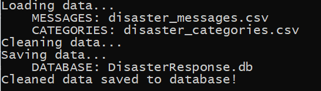
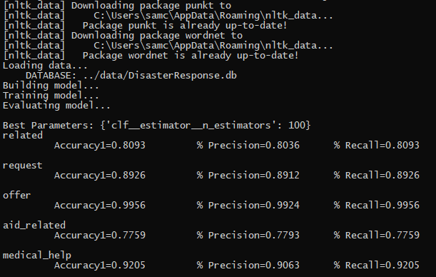
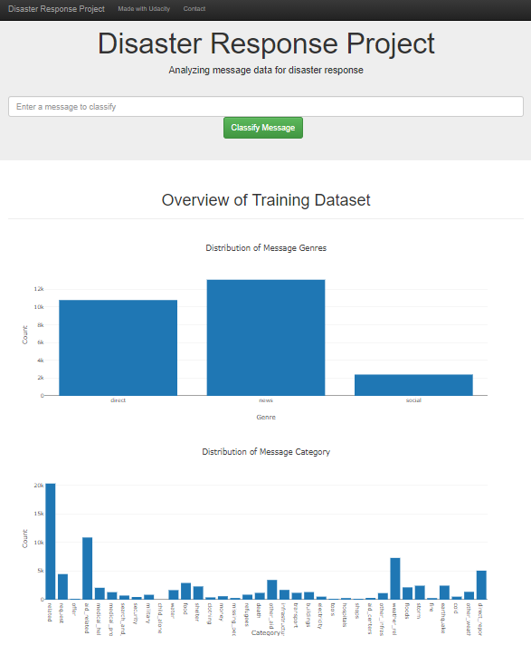

# Disaster Response Pipeline Project


### Table of Contents

1. [Introduction](#introduction)
2. [What's included](#included)
3. [File Descriptions](#files)
3. [Installation](#installation)
4. [Instructions](#instructions)
5. [Licensing, Authors, and Acknowledgements](#licensing)


## Introduction <a name="introduction"></a>

The project aims at providing a web application called "Disasters" for end-users to enter text message during disaster, and it is able to classify the text message into 36 categories.

## What's included <a name="included"></a>

```text
(project folder)/
├── data/
│   ├── disaster_categories.csv
│   ├── disaster_messages.csv
│   ├── process_data.py
│   ├── output.png
│   ├── (DisasterResponse.db)
├── models/
│   ├── train_classifier.py
│   ├── output.png
│   ├── (classifier.pkl) 
├── share/
│   ├── share_lib.py
└── app/
    ├── run.py
    ├── output.png
    ├── templates/
        ├── go.html
        ├── master.html
```


## File Descriptions <a name="files"></a>

1. data/disaster_categories.csv
    - Categories dataset from Figure Eight.
2. data/disaster_messages.csv
    - Messages dataset from Figure Eight.
3. data/process_data.py
    - Python script file for ETL pipeline.
4. data/output.png
    - Screenshot of process_data.py output.
5. data/DisasterResponse.db
    - The output database file combining Categories and Messages datasets. This file is not initially included in the project, but generated after executing process_data.py.
6. models/train_classifier.py
    - Python script file for ML pipeline.
7. models/output.png
    - Screenshot of train_classifier.py output.
8. models/classifier.pkl
    - The saved model generated by train_classifier.py.
9. share/share_lib.py
    - A shared python library used by different python scripts.
10. app/run.py
    - The web application "Disasters" for end-user to enter custom message and get classification result.
11. app/output.png
    - Screenshot of web application "Disasters".
12. app/templates/go.html
	- HTML template file used by the web application "Disasters".
13. app/templates/master.html
	- HTML template file used by the web application "Disasters".

## Installation <a name="installation"></a>

The code should run with no issues using Python versions 3.6.3

Python libraries used in the project:
1. pandas
2. numpy
3. sqlalchemy
4. re
5. nltk
6. nltk.tokenize 
7. nltk.stem 
8. sklearn.model_selection
9. sklearn.pipeline
10. sklearn.base
11. sklearn.feature_extraction.text 
12. sklearn.ensemble
13. sklearn.multioutput
14. sklearn.metrics
15. json
16. plotly
17. plotly.graph_objs
18. flask
19. joblib
20. sys

### Instructions <a name="instructions"></a>
1. Run the following commands in the project's root directory to set up your database and model.

    - To run ETL pipeline that cleans data and stores in database
        `python data/process_data.py data/disaster_messages.csv data/disaster_categories.csv data/DisasterResponse.db`
		
		 

    - To run ML pipeline that trains classifier and saves
        `python models/train_classifier.py data/DisasterResponse.db models/classifier.pkl`
		 

		### Please note that ML pipeline takes time to train model. In a testing machine with Intel i7 CPU and 32GB ram, it took 2 hours to complete.
		
2. Run the following command in the app's directory to run your web app.
    `python run.py`

3. Go to http://localhost:3001/

    


## Licensing, Authors, Acknowledgements<a name="licensing"></a>

Code released under the MIT License. Must give credit to Figure Eight for the data.
